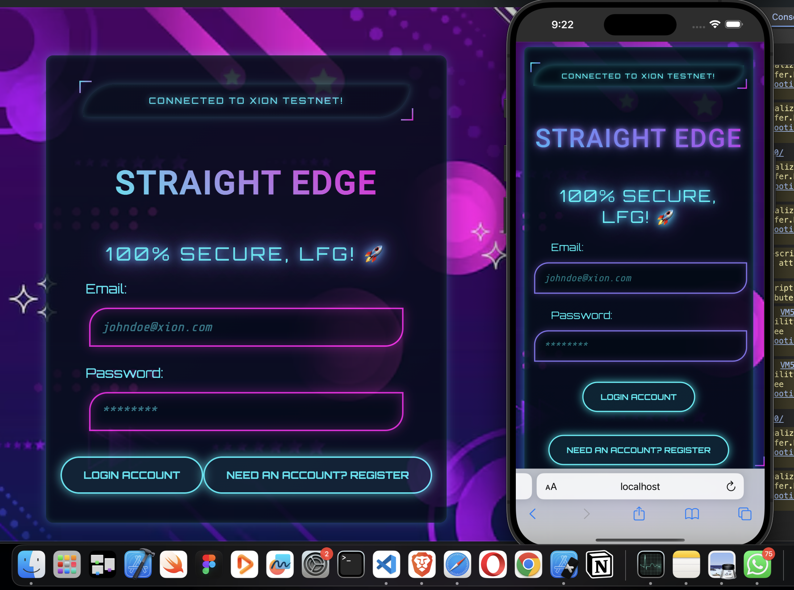

# Straight Edge on Xion

## Project Overview
A lightweight, gamified DApp built on Xion Network that rewards users with testnet tokens for simple interactions. The vision for `Straight Edge` from [The Sarcastic Geeks Trybe 🚀](https://x.com/sarcasticgeek4u) is to onboard as many users to xion network using the easiest onchain gaming, leveraging the surge that telegram gaming had enjoyed in the past as a result of the web2 authentication.

The difference here is that, unlike the telegram which were not strictly onchain, `Straight Edge` records the [transactions onchain](https://explorer.burnt.com/xion-testnet-1/account/xion1y3mc9j767lmnc0fx3jl6zur0klprmywth45evd). 

This is the first version of the app, the Community promises more interactive games like puzzles, maze, NFT game assets, etc. while maintaining the onchain point records.

### The app features:
- Tap-to-earn mechanics with visual feedback
- Smart cooldown system to prevent spam
- Seamless Xion wallet integration
- Real-time balance updates
- Transaction confirmation flow

## Key Features
✅ **User-Friendly Interface**  
✅ **Testnet Token Rewards**  
✅ **Wallet Integration**  
✅ **Web2 Experience and Authentication**  
✅ **Anti-Spam Protection**  
✅ **Real-Time Updates**  

## Technology Stack
- **Frontend**: React.js with Vite
- **Styling**: CSS3 with animations
- **Database**: Firestore from Firebase
- **Blockchain**: Xion Network 
- **Wallet**: Xion Wallet Integration
- **Testnet**: [Faucet Funding](https://faucet.xion.burnt.com/)

## Funding Goals
1. Enhance security audits
3. Implement additional gamification features
4. Expand to mainnet at launch
5. Marketing and user acquisition

## Project Contributions
Special thanks to every contribution to the current success of the movement.
 - [JayTechEnt](https://github.com/Jaytechent) 
 - [Gozkybrain](https://github.com/Gozkybrain) 
 - [The Sarcastic Geeks Trybe](https://x.com/sarcasticgeek4u)

*Built for the Xion ecosystem - Redefining user onboarding in web3*
